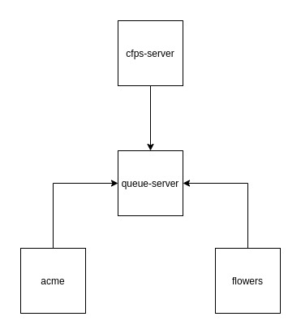

# LAB - 19

## Message Queue Server

### Author: Travis Skyles

### Links and Resources
* [submission PR](https://github.com/tskyles-401-advanced-javascript/401-lab-19/pull/1)
* [travis](https://travis-ci.com/tskyles-401-advanced-javascript/401-lab-19)

### Setup
#### How to initialize/run your server app (where applicable)
* `node` cfps-server
* `node` queue-server
* `node` acme-widgets
* `node` flower-shop
* hit routes to send messages
  
#### Tests
* Unit Tests: `npm test`
* Lint Tests: `npm run lint`

#### UML
